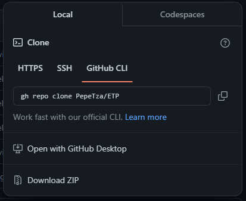

# ETP
Dios en ti confio

Usar el comando "npm run dev" para iniciar el juego

El juego acepta de un jugador y de varios, no se podra iniciar si no existe un anfitrio, no puede haber mas de un anfitrion, no se pueden repetir nombres para los jugadores, los nombres no pueden tener espacios y tener por lo menos dos caracteres. Esas comprobaciones estan hechas de todas formas, solo informo para que se le haga mas rapido correr el juego, una vez iniciada una partida si un jugador nuevo intenta entrar se le añadira a la lista de jugadores pero tendra que esperar que la partida actual termina e inicie otra para poder jugar, los jugadores que se desconecten seran sacados de la lista al terminar una partida por lo que se podran usar sus nombres otra vez.

Siendo sincero el programa explota en algun lugar pero no me dio tiempo de corregirlo, pero confio que en una partida normal no pasara, ya que creo que lo que lo origina es que los jugadores se desconectan a media partida, la cuestion es que no sucede en todos los casos.

Dependencias {

    "express": "^4.18.2",
    "websocket": "^1.0.34",
    "ws": "^8.16.0"
}

Pude comprobar que al usar esta opcion el juego corre bien, recomiendo usarla al probarlo, solo asegurese de estar en la carpeta del proyecto

PD: Dios en ti confio